# DesarrolloAplicacionesWeb
Desarrollo de Aplicaciones Web | GIS | Universidad Rey Juan Carlos 2017/2018

## FASE 1

### 1. Nombre de la aplicacion Web: OnControlHome [OCH] 

### 2. Descripcion: 
Aplicacion Web, para la compra de un servicio con el cual puedes controlar las persiana y lamparas de una vivienda.   
Pudiendo según el servicio, subir y bajar las persianas y apagar o encender la luz, desde cualquier dispositivo movil y computadoras.     
Pudiendo visualizar el consumo energetico.

### 3. Integrantes del Equipo de Desarrollo:  
| Nombre | Mail | GitHub     |
| --- | --- | --- |
| Galindo Peña, Jorge        | j.galindop@alumnos.urjc.es      | [JorgeGalingP](https://github.com/JorgeGalingP) |
| Macias Medina, Daniel      | d.maciasm@alumnos.urjc.es       | [DaniMaci](https://github.com/DaniMaci) |
| Serrano Rodriguez, Ramon   | r.serranoro@alumnos.urjc.es     | [RamonSpain](https://github.com/RamonSpain) |
| Velazquez Sanchez, Cristian  | c.velazquezs@alumnos.urjc.es    | [CVelazquezURJC](https://github.com/VelazquezURJC) |
| Vizcaino Santana, Hugo Samuel | hs.vizcaino@alumnos.urjc.es     | [Hgmoa](https://github.com/Hgmoa) |

### 4. Tablero de organizacion: 
https://github.com/Hgmoa/DesarrolloAplicacionesWeb/projects/1

### 5. Secciones:

####   - Tablas/Entidades:
         - Usuario: Guarda los datos de cada usuario.     
         - Casa: Direccion exacta y codigo postal.    
         - Dispositivos: Cantidad y Tipos de dispositivos.    
         - Mediciones: Guarda los datos de valor y fecha para realizar graficos.    

####   - Funcionalidad Avanzada:
         - Mediciones y comparativas por zona (cofigo postal) en gasto.(Presentacion en grafica)    
         - Aviso al usuario en caso de uso excesivo.    

####   - Requisitos Tecnicos:
         - Mostrar consumo de usuario por grafico de barras o puntos.    
         - Gestion de imagenes de usuarios (avatar).    
         - Social Login. (Facebook, Google)    
         - API externa del tiempo.    
         - Descarga de datos en PDF.    
    
## FASE 2
### 1.Capturas de Pantalla 
SIN REGISTRAR
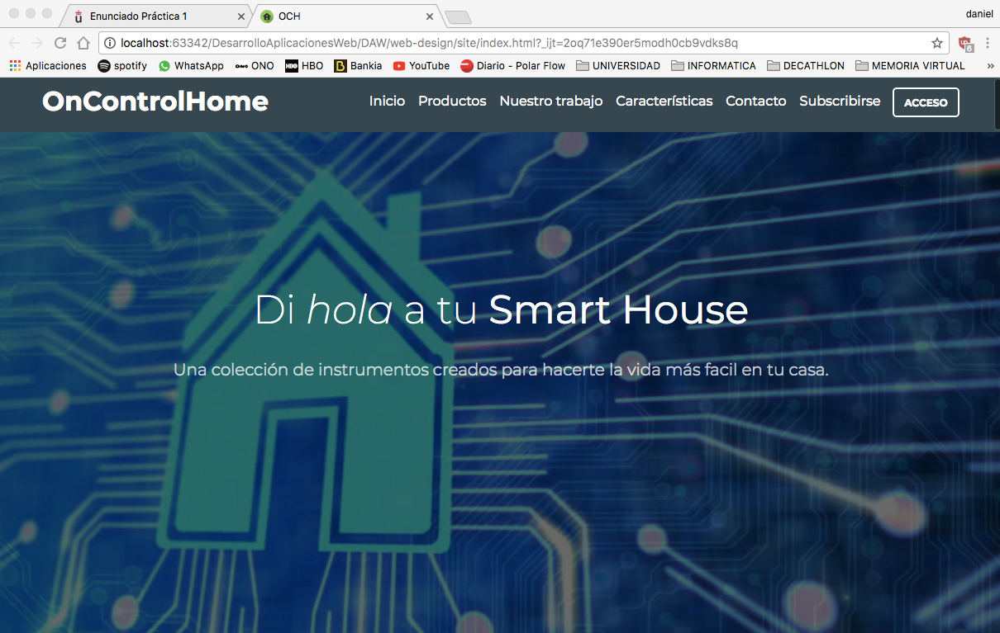     
  
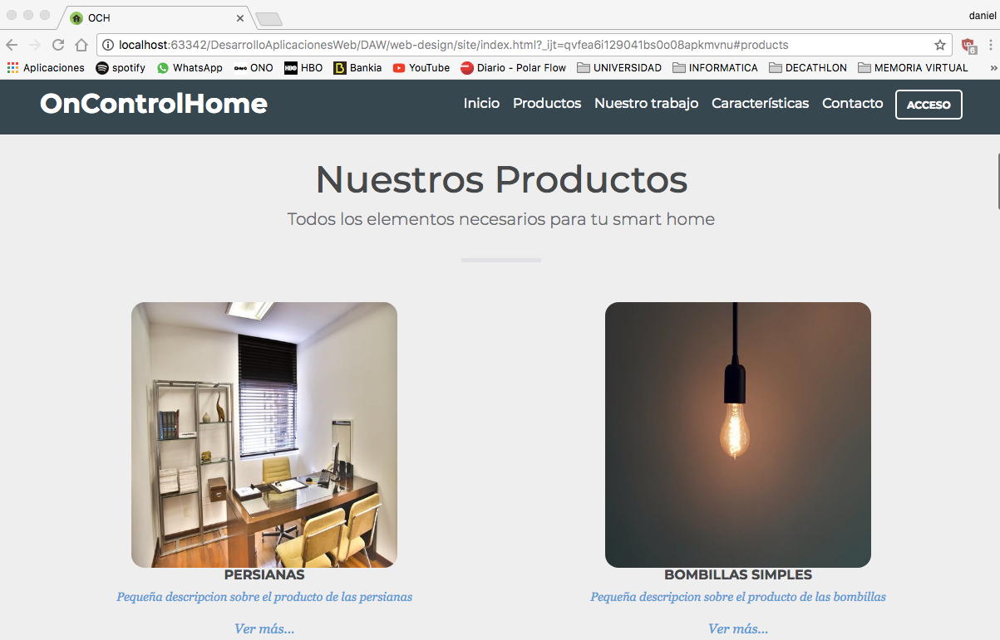  
Pagina principal, visualizacion para cualquier usuario, pudiendo ver apartados como, caracteristicas, quienes somo, tansolo con bajar con el raton, como pulsando el los propios nombres.(ejemplo nuestro trabajo y productos).
    

Para poder entrar como usuario, pudiendo recordar contraseña, o registrate.

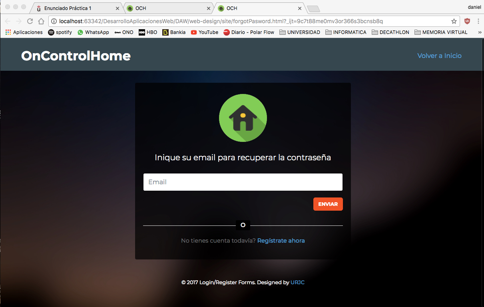     
Para introducir el correo y que te recuerden la contraseña.

     
Página donde deves rellenar los datos más caracteristicos para registrarte en la página, puedes hacerlo via facebook, google...

     
Página cuando hay error 404

     
Página cuando hay error 500

CON REGISTRO

 
Desde esta pantalla controlaremos lo general de la casa. Luces persianas,...

 
Perfil del cliente que está dado de alta en nuestro servicio con información general sobre el.

Formularios para las diferentes aspectos de la aplicación.

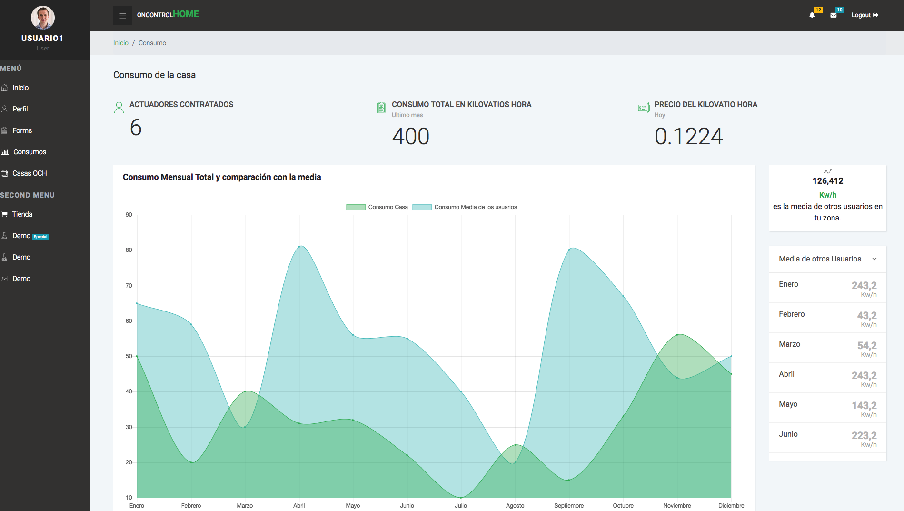
Graficas que muestran el consumo de la casa.

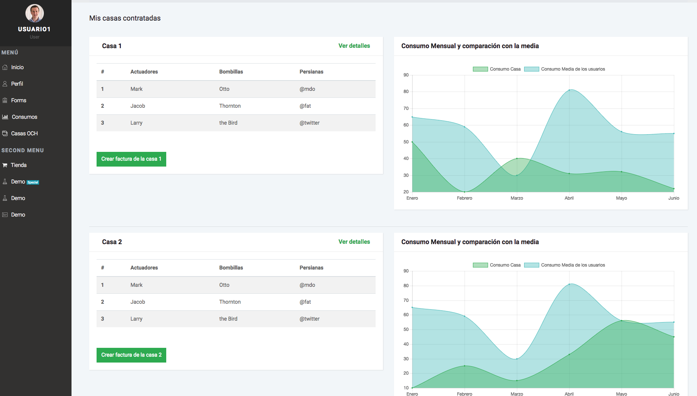
Consumo de las diferentes casas que pueda tener un mismo usuario

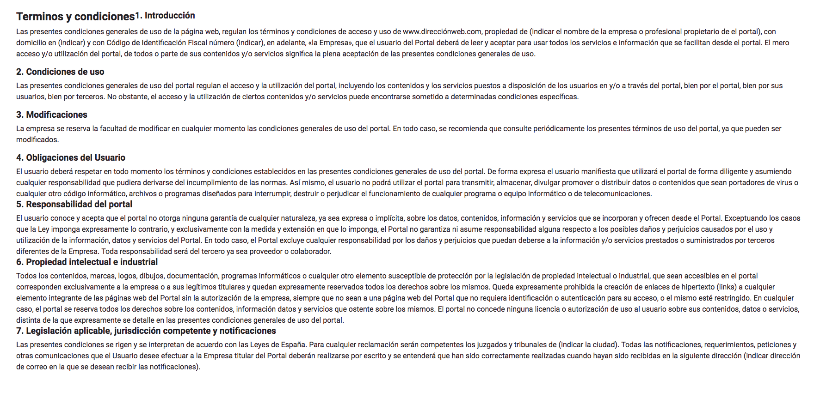
Terminios y condiciones legales

### 2. Diagrama de navegación
Cliente sin registrar:
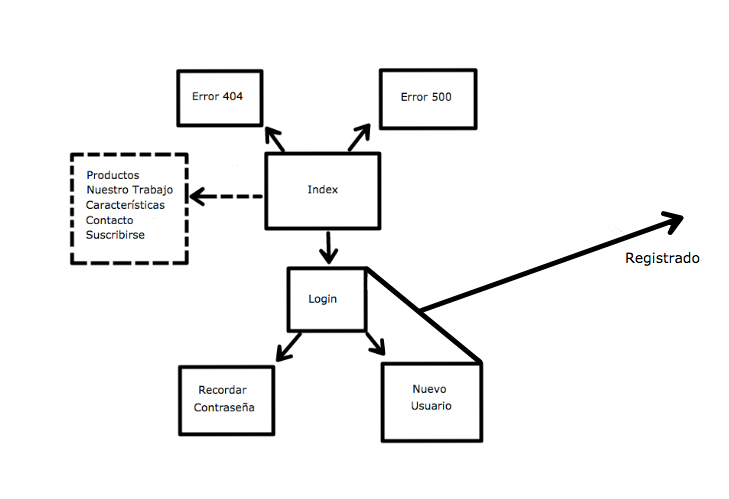 

Cliente registrado:
 

## FASE 3
### Capturas de pantalla
DASHBOARD ADMINISTRADOR
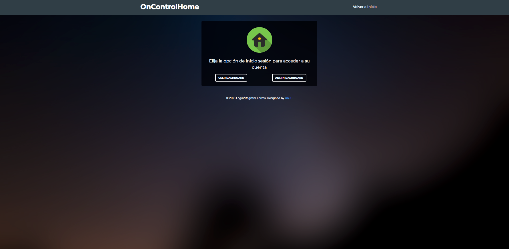
Inicio de la pantalla de la parte del usuario administrador donde puede elegir entre admin Dashboard o user Dashboard 

Inicio de la parte de admin dashboard

Inventario donde el administrador puede cambiar el numero de dispositivos que tenemos (Luces, persianas, Rasberry)

Usuarios que estan dados de alta en nuestra aplciación

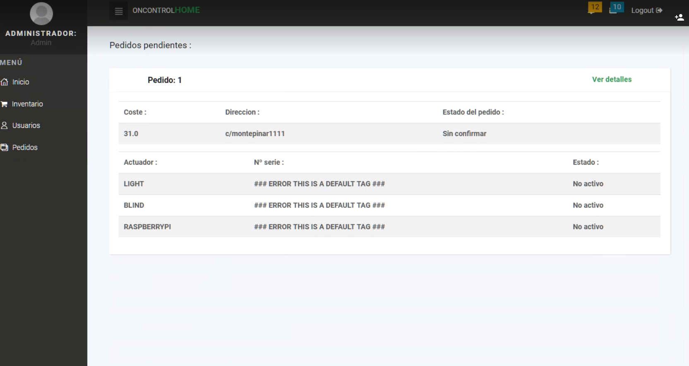
Ordenes de instalacion de las diferentes casas de los usuarios

Ordenes de instalacion donde se confirmarán o se ancelaran dando de alta los dispositivos pertinentes

DASHBOARD USUARIO
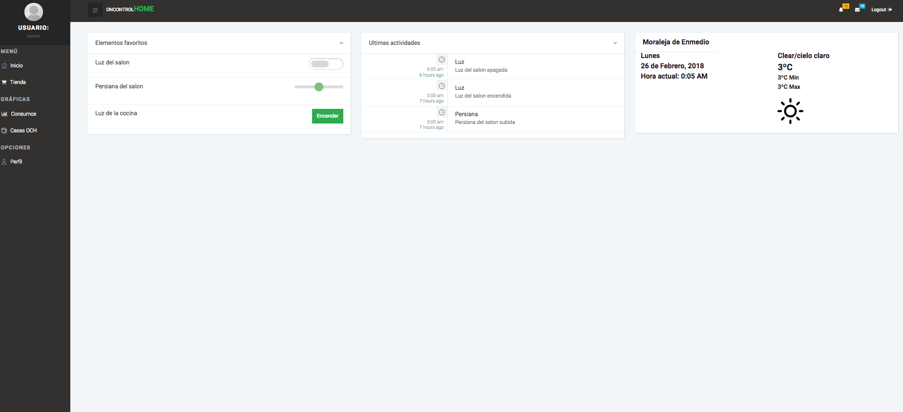
Inicio de la parte de usuar dashboard

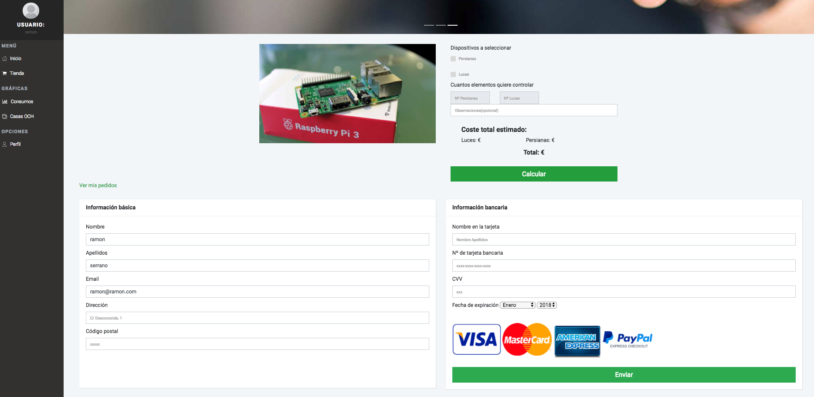
Creacion de las ordenes de instalacion para las diferentes casas que tenga el cliente

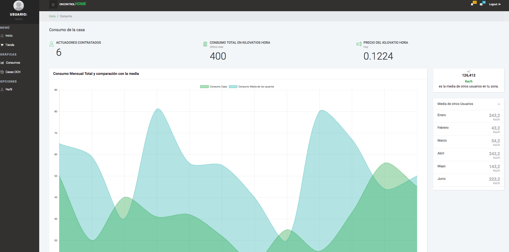
Graficas del usuario que muestra como va su consumo propio y como va su consumo frente a los de otros usuarios de su zona

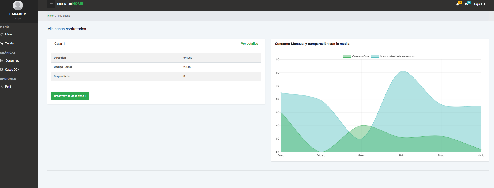
Casas contratadas del usuario 

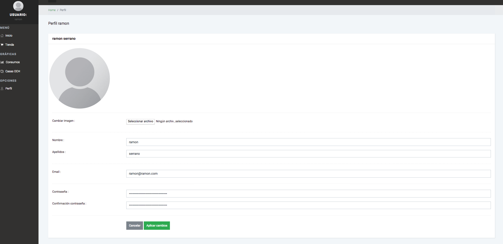
Perfil del usuario donde puede modificar sus datos y su imagen de avatar

### Diagrama de base de datos
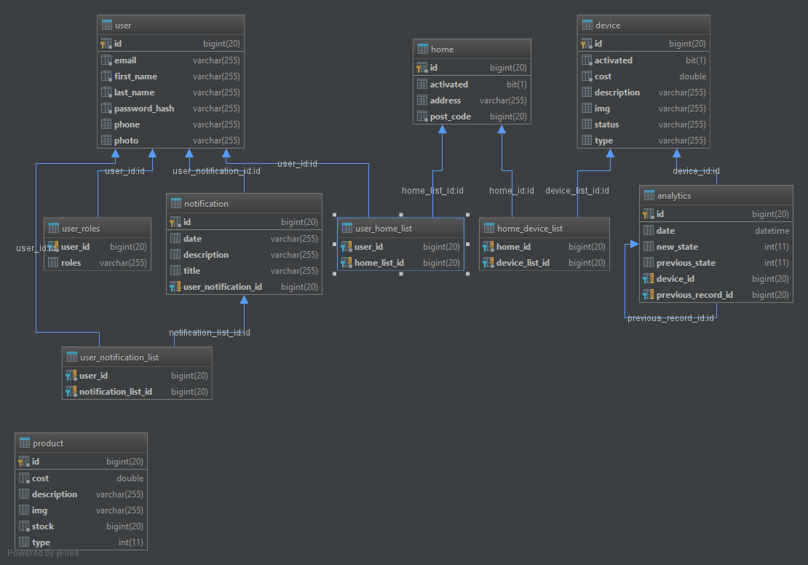
La entidad con la base de datos están relacionadas de la forma que los usuario tienen una entidad 
que se guarda en la base de datos, donde tendrán su identificador generado automaticamente, guardando su nombre, apellidos, email, contraseña, telefono, listas de casas junto con los roles, 
que estos últimos son los que se utilizan para la seguridad con Spring.
### Diagrama de clases
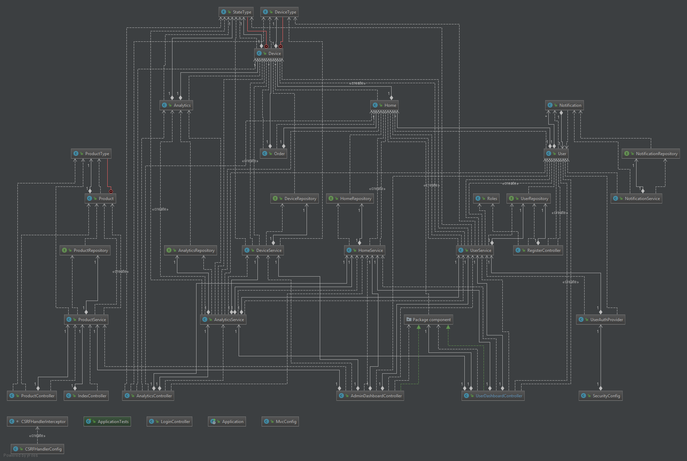

### Entorno de desarrollo
Para poder instalar y desarrollar una aplicación con Spring Boot, desde cualquier editor de código podrás abrir la aplicaciónl, pero se recomienda abrir la aplciación con [STS](http://spring.io/tools/sts/all)
También es obligatorio el uso de una base de datos [MySQL](https://dev.mysql.com/downloads/mysql/), con la siguiente configuración.
localhost:3306

| Nombre Base de datos | usuario | contraseña     |
| --- | --- | --- |
| oncontrolhome        | root      | root |

### Diagrama de clases y template
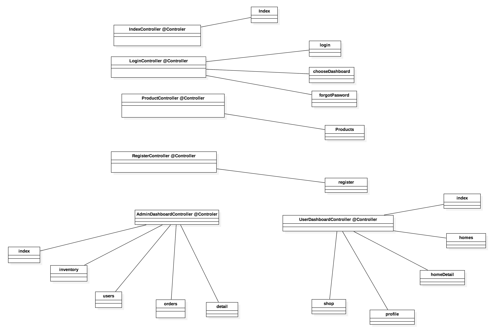
Diagrama de clases y template donde se muestra la relación de los controladores con sus archivos HTML. Como se puede ver en las imágenes anteriores mostramos las relaciones entre los controladores con los 
servicios y repositorios. Por tanto para realizar la relación en su proyecto debe de mirar en todas las imágenes para poder tener las mismas relaciones. 

## FASE 4
### Documentación de la API : [api](API.md)

### Diagrama de clases y template [@restController]
Nuevos Rescontroles y sus dependencias.
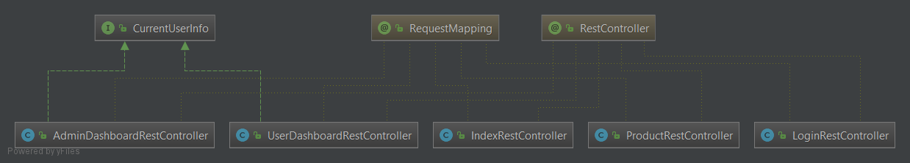

Nuevos rescontroles con sus dependencias y sus métodos.
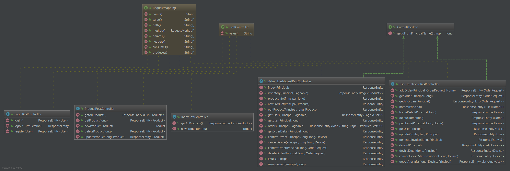

Diagrama de clases y template donde se muestra la relación de los nuevos RestControladores. Como se puede ver en la imágene anterior mostramos las relaciones entre los controladores y RestController con los 
servicios y repositorios. Por tanto para realizar la relación en su proyecto debe de mirar en todas las imágenes para poder tener las mismas relaciones. 

### Instrucciones de ejecución de la aplicación dokerizada usando el docker-compose.yml
Usamos docker-compose version 2.3 ya que nos permite comprobar mediante "[healthchecks](https://docs.docker.com/compose/compose-file/compose-file-v2/#healthcheck)" el estado de la base de datos para no permitir que la aplicacion de spring boot ejecute sin estar la misma lista.  
Las rutas sobre los volumenes que utilizan los contenedores docker y las variables de entorno para el acceso y generacion de la base de datos se encuentran en el fichero [docker-compose.yml](docker/docker-compose.yml) pudiendose editar segun sea necesario.  

| Nº Paso | Instrucción |
| --- | --- |
| 1 | Clonar repositorio | 
| 2 | Acceder por consola a la carpeta /docker del proyecto|
| 3 | Ejecutar docker-compose up para levantar la base de datos y el servidor|

### Preparación del entorno de desarrollo
| Nº Paso | Instrucción |
| --- | --- |
| 1 | Descargar Postman. | 
| 2 | Generar solicitudes cambiando el método en Postman a uno de los siguientes GET, POST, PUT y DELETE.|
| 3 | Nuestra API tiene un lado público donde puedes ver la información de quienes somos, lo que hacemos y nuestros productos. |
| 4 | Dos partes privadas. La primera como cliente registrado puediendo ver tus facturas, graficas, consumos y pedidos, para ello debes iniciar sesión como usuario. Una segunda parte privada que es como administrador, que tienes acceso a los pedidos y a las características de los usuarios, para ello tienes que registrarte con los permisos de administrador. |
| 5 | Una vez que haya iniciado sesión o sin iniciarla, puede enviar todas las solicitudes que desee (siempre siguiendo nuestras reglas). |
| 6 | Si quieres terminar tu sesión, usa el endpoint  /api/logout. |

### Instrucciones de desarrollo
| Nº Paso | Instrucción |
| --- | --- |
| 1 | Clonar repositorio| 
| 2 | Acceder por consola a la carpeta /docker del proyecto |
| 3 | Editar el Dockerfile segun las necesidades del desarrollador (cambiar ruta o nombre del archivo, etc.)|
| 4 | En el archivo create_image (.sh para unix, .bat para windows), modificar el tag de la imagen para referenciarla al repositorio propio |
| 5 | Cambiar tambien en los ficheros publish_image.(bat/sh) y run_image.(bat/sh) el nombre y tag de la imagen al modificado anteriormente |
| 6 | Realizar docker login en caso de no estar logueado, y ejecutar el fichero publish_image.(bat/sh) |
| 7 | Referenciar en el fichero docker-compose.yml la imagen subida a su repositorio |
