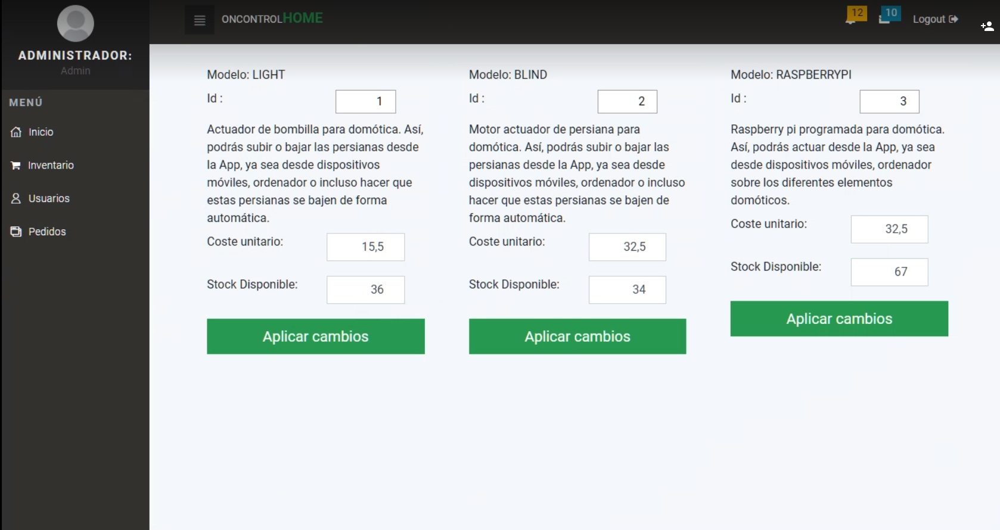
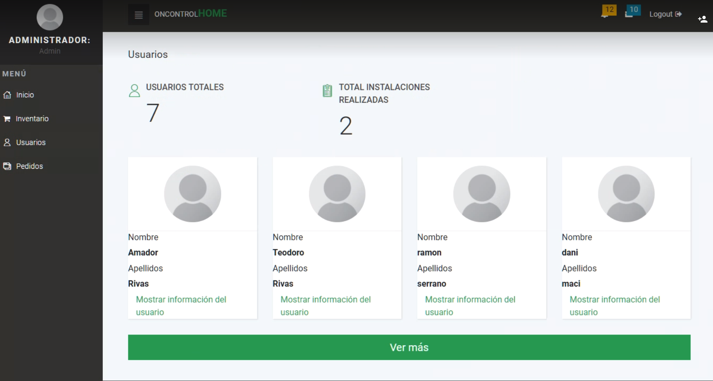
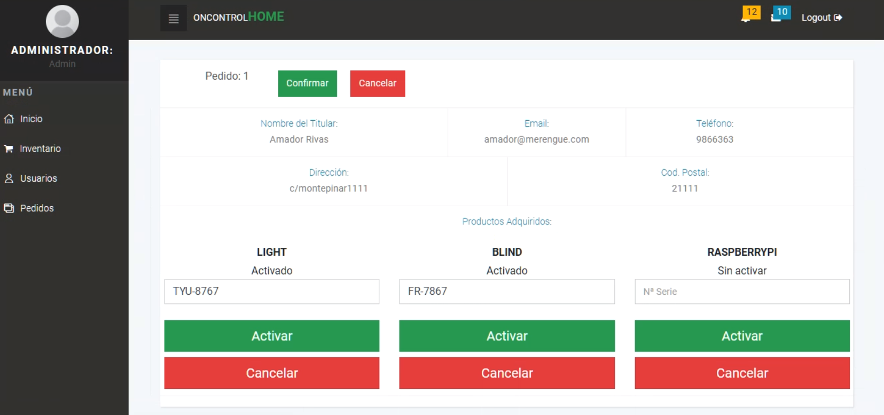

# DesarrolloAplicacionesWeb
Desarrollo de Aplicaciones Web | GIS | Universidad Rey Juan Carlos 2017/2018

## FASE 1

### 1. Nombre de la aplicacion Web: OnControlHome [OCH] 

### 2. Descripcion: 
Aplicacion Web, para la compra de un servicio con el cual puedes controlar las persiana y lamparas de una vivienda.   
Pudiendo según el servicio, subir y bajar las persianas y apagar o encender la luz, desde cualquier dispositivo movil y computadoras.     
Pudiendo visualizar el consumo energetico.

### 3. Integrantes del Equipo de Desarrollo:  
| Nombre | Mail | GitHub     |
| --- | --- | --- |
| Galindo Peña, Jorge        | j.galindop@alumnos.urjc.es      | [JorgeGalingP](https://github.com/JorgeGalingP) |
| Macias Medina, Daniel      | d.maciasm@alumnos.urjc.es       | [DaniMaci](https://github.com/DaniMaci) |
| Serrano Rodriguez, Ramon   | r.serranoro@alumnos.urjc.es     | [RamonSpain](https://github.com/RamonSpain) |
| Velazquez Sanchez, Cristian  | c.velazquezs@alumnos.urjc.es    | [CVelazquezURJC](https://github.com/VelazquezURJC) |
| Vizcaino Santana, Hugo Samuel | hs.vizcaino@alumnos.urjc.es     | [Hgmoa](https://github.com/Hgmoa) |

### 4. Tablero de organizacion: 
https://github.com/Hgmoa/DesarrolloAplicacionesWeb/projects/1

### 5. Secciones:

####   - Tablas/Entidades:
         - Usuario: Guarda los datos de cada usuario.     
         - Casa: Direccion exacta y codigo postal.    
         - Dispositivos: Cantidad y Tipos de dispositivos.    
         - Mediciones: Guarda los datos de valor y fecha para realizar graficos.    

####   - Funcionalidad Avanzada:
         - Mediciones y comparativas por zona (cofigo postal) en gasto.(Presentacion en grafica)    
         - Aviso al usuario en caso de uso excesivo.    

####   - Requisitos Tecnicos:
         - Mostrar consumo de usuario por grafico de barras o puntos.    
         - Gestion de imagenes de usuarios (avatar).    
         - Social Login. (Facebook, Google)    
         - API externa del tiempo.    
         - Descarga de datos en PDF.    
    
## FASE 2
### 1.Capturas de Pantalla 
SIN REGISTRAR
     
  
  
Pagina principal, visualizacion para cualquier usuario, pudiendo ver apartados como, caracteristicas, quienes somo, tansolo con bajar con el raton, como pulsando el los propios nombres.(ejemplo nuestro trabajo y productos).
    

Para poder entrarcomo usuario, pudiendo recordar contraseña, o registrate.

     
Para introducir el correo y que te recuerden la contraseña.

     
Página donde deves rellenar los datos más caracteristicos para registrarte en la página, puedes hacerlo via facebook, google...

     
Página cuando hay error 404

     
Página cuando hay error 500

CON REGISTRO

 
Desde esta pantalla controlaremos lo general de la casa. Luces persianas,...

 
Perfil del cliente que está dado de alta en nuestro servicio con información general sobre el.

Formularios para las diferentes aspectos de la aplicación.

Graficas que muestran el consumo de la casa.

Consumo de las diferentes casas que pueda tener un mismo usuario

Terminios y condiciones legales

### 2. Diagrama de navegación
Cliente sin registrar:
 

Cliente registrado:
 

## FASE 3
### Capturas de pantalla
DASHBOARD ADMINISTRADOR

Inicio de la pantalla de la parte del usuario administrador donde puede elegir entre admin Dashboard o user Dashboard 

Inicio de la parte de admin dashboard

Inventario donde el administrador puede cambiar el numero de dispositivos que tenemos (Luces, persianas, Rasberry)

Usuarios que estan dados de alta en nuestra aplciación

Ordenes de instalacion de las diferentes casas de los usuarios

Ordenes de instalacion donde se confirmarán o se ancelaran dando de alta los dispositivos pertinentes

DASHBOARD USUARIO

Inicio de la parte de usuar dashboard

Creacion de las ordenes de instalacion para las diferentes casas que tenga el cliente

Graficas del usuario que muestra como va su consumo propio y como va su consumo frente a los de otros usuarios de su zona

Casas contratadas del usuario 

Perfil del usuario donde puede modificar sus datos y su imagen de avatar

### Diagrama de base de datos

La entidad con la base de datos están relacionadas de la forma que los usuario tienen una entidad 
que se guarda en la base de datos, donde tendrán su identificador generado automaticamente, guardando su nombre, apellidos, email, contraseña, telefono, listas de casas junto con los roles, 
que estos últimos son los que se utilizan para la seguridad con Spring.
### Diagrama de clases

### Entorno de desarrollo
Para poder instalar y desarrollar una aplicación con Spring Boot, desde cualquier editor de código podrás abrir la aplicaciónl, pero se recomienda abrir la aplciación con STSsource-tool-suite (http://spring.io/tools/sts/all)
También es obligatorio el uso de una base de datos MySQL Workbenck (https://dev.mysql.com/downloads/workbench/), con la siguiente configuración.
localhost:3306

| Nombre Base de datos | usuario | contraseña     |
| --- | --- | --- |
| oncontrolhome        | root      | root |

### Diagrama de clases y template

Diagrama de clases y template donde se muestra la relación de los controladores con sus archivos HTML. Como se puede ver en las imágenes anteriores mostramos las relaciones entre los controladores con los 
servicios y repositorios. Por tanto para realizar la relación en su proyecto debe de mirar en todas las imágenes para poder tener las mismas relaciones. 

## FASE 3
### Documentación de la API : [api](API.md)

### Diagrama de clases y template [@restController]

Diagrama de clases y template donde se muestra la relación de los nuevos RestControladores con sus archivos HTML. Como se puede ver en la imágene anterior mostramos las relaciones entre los controladores y RestControler con los 
servicios y repositorios. Por tanto para realizar la relación en su proyecto debe de mirar en todas las imágenes para poder tener las mismas relaciones. 

### Instrucciones de ejecución de la aplicación dokerizada usando el docker-compose.yml
| Nº Paso | Instrucción |
| --- | --- |
| 1 | | 
| 2 | |
| 3 | |

### Preparación del entorno de desarrollo
| Nº Paso | Instrucción |
| --- | --- |
| 1 | | 
| 2 | |
| 3 | |

### Instrucciones de desarrollo
| Nº Paso | Instrucción |
| --- | --- |
| 1 | | 
| 2 | |
| 3 | |